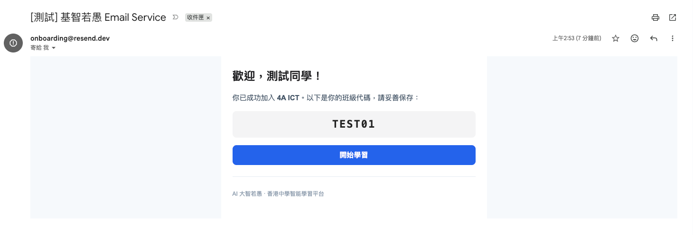
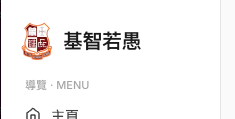
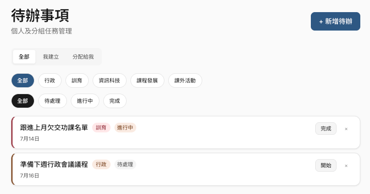
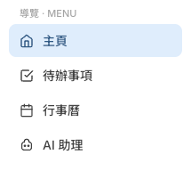
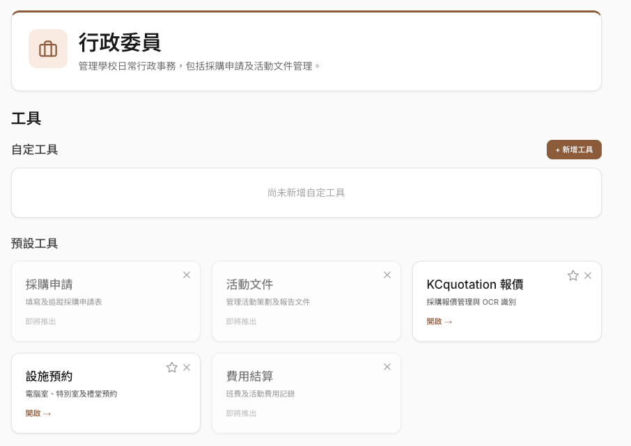
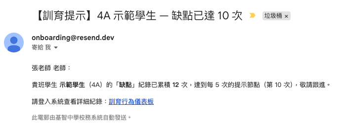
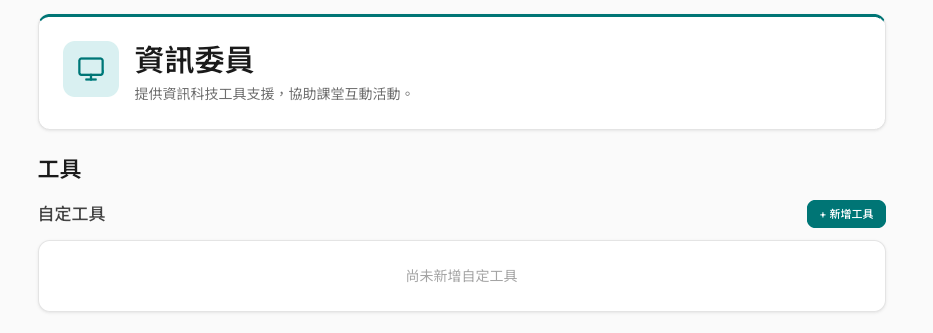
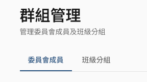
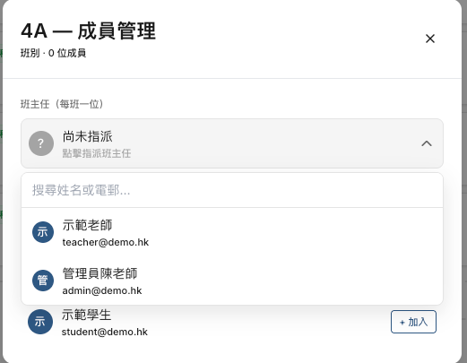
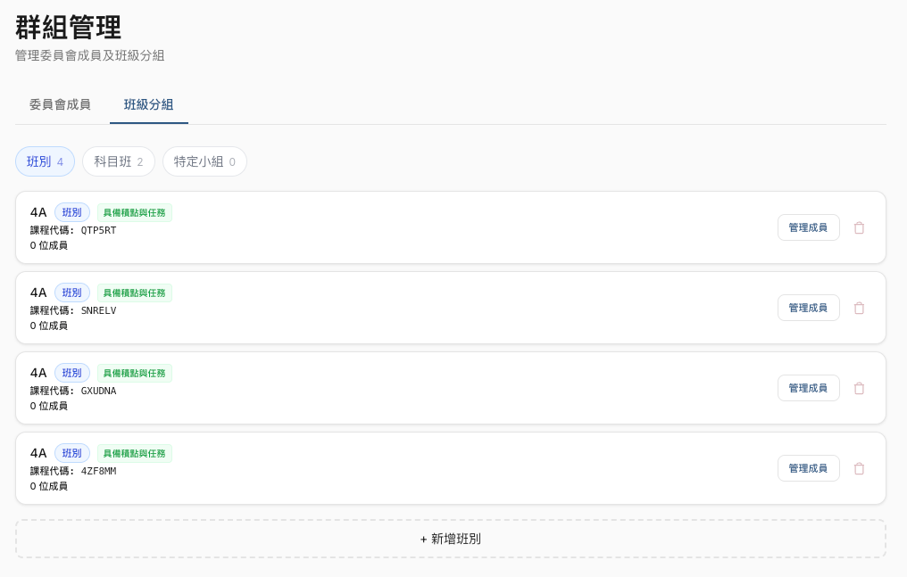

# 功能待辦進度

> 對照 `ALL.md` 逐項標記：✅ = 已完成（附效果預覽圖於 `img/`）；⬜ = 尚未完成。
> 複合敘述（同一段含兩件事）會拆開標記，如「群組管理」一項已完成改名、另一項待做。

---

## 網站全局基建服務
- ✅ 建立基於 Resend 的郵件發送服務層，供各模塊後續接入使用。

  

  **交付**：`src/lib/email.ts`（singleton client + `sendEmail()`，無 `RESEND_API_KEY` 時自動 no-op）· `src/emails/welcome-email.tsx` 範例模板 · `npm run email:test` 測試腳本 · `docs/email-service.md`（設定／網域驗證／批次排程等未來擴充）。

  **驗證**：測試信經 `onboarding@resend.dev` 送達帳號信箱（見圖），message id `10bc313a-b7fd-4ba9-945b-80d9e54923ce`。

  **待辦（部署）**：自有網域尚未驗證、`RESEND_FROM` 未設 → 目前僅能寄到 Resend 帳號本人信箱；正式寄給學生前需完成 `docs/email-service.md` §2 的網域驗證。

- ⬜ 整合 Google Cloud 的 Google Calendar API，提供日曆服務層。

## 網站 Logo
- ✅ 移除英文字樣「ICHI」（教師／學生側欄 Logo 區塊）。

  

## 待辦事項
- ✅ 修復：待辦事項無法於列表中顯示的問題。
  
  **原因**：`GET /api/todos` 的角色判斷只認 `TEACHER`，`ADMIN` 落入「學生」分支（只查分配給自己的），而 seed 待辦皆無 assignee → admin 帳號查得 0 筆、列表為空。
  **修復**：改用 `isTeacherOrAdmin()`，TEACHER / ADMIN 一律視為教職員（看自己建立 + 分配給自己的）。已對本地 seeded DB 驗證：admin 可見待辦 0 → 2。

## 公告
- ✅ 隱藏入口（教師側欄）。

## 活動管理
- ✅ 隱藏入口（教師 + 學生側欄）。

## 任務管理
- ✅ 隱藏入口（教師 + 學生側欄）。

## 績點
- ✅ 隱藏入口（教師 + 學生側欄）。

> 以上「公告 / 活動管理 / 任務管理 / 績點」隱藏共用下圖（側欄已不顯示這些連結，路由本身保留）：

## 行事曆
- ⬜ 新增：將活動同步至用戶外部 Google Calendar。

## 行政
- ✅ 新增：將「活動文件」嵌入式網站轉換為站內預設工具「活動文件」。
- ✅ 新增：將「Quotation」嵌入式網站轉換為站內預設工具「KCquotation 報價」。

  「行政委員」頁現以「預設工具」呈現（不再為 EMBED 自定工具）：採購申請、活動文件、KCquotation 報價、設施預約、費用結算。

  

## 訓育
- ✅ 新增：「行為記錄」新增記錄時，依「訓育設定」自動觸發電郵通知班主任。

  **交付**：`src/lib/discipline.ts` 的 `checkThresholdAndEmail()`（每類別 × 每學生，**每達門檻倍數通知一次**：門檻 5 → 5/10/15…各一封）與 `checkClassAlert()`（全班違規總數，每達班級門檻倍數通知一次）。班主任 email 取自「群組管理 - 班級分組」的 `Class.homeroomTeacher`（`findHomeroom()`）。

  **可靠度**：採「**先寄信、成功後才標記 `notifiedCount`**」——寄信失敗不會被誤標為已通知，下次新增記錄會重試，避免靜默漏發（門檻以 `Math.floor(count/threshold)*threshold` 計算已達最高倍數，即使一次跳多筆也能抓到節點）。

  

- ✅ 補充：班主任電郵已於「群組管理 - 班級分組」綁定（`Class.homeroomTeacherId`），並已接入上述電郵觸發發送。

## 資訊科技
- ✅ 移除：「Quotation」及「KCquotation 報價」入口。

  

## 群組管理
- ✅ 更新：將「學生分組」更名為「班級分組」。

  

- ✅ 「班級分組 - 成員管理」視窗允許綁定教職員 → 實作為**每班一位班主任**。

  

- ✅ 修復：班級分組標籤頁在管理員身份下無法正確渲染班級列表。

  

---

## 進度總覽

| 模塊 | 狀態 |
|------|------|
| 基建 - Resend 郵件服務層 | ✅ 完成（自有網域待驗證） |
| 基建 - Google Calendar 日曆服務層 | ⬜ 待做 |
| 網站 Logo（移除 ICHI） | ✅ 完成 |
| 待辦事項（列表顯示 bug） | ✅ 完成 |
| 公告 / 活動管理 / 任務管理 / 績點（隱藏入口） | ✅ 完成 |
| 行事曆（同步外部 Google Calendar） | ⬜ 待做 |
| 行政（活動文件 / KCquotation 轉預設工具） | ✅ 完成 |
| 訓育（班主任電郵綁定） | ✅ 完成（欄位 + UI）* |
| 訓育（行為記錄電郵觸發發送） | ✅ 完成（每門檻倍數通知 · 先寄後標記） |
| 資訊科技（移除 Quotation 入口） | ✅ 完成 |
| 群組管理（改名「班級分組」） | ✅ 完成 |
| 群組管理（成員管理綁定教職員／班主任） | ✅ 完成* |
| 群組管理（管理員身份下班級列表渲染修復） | ✅ 完成 |
